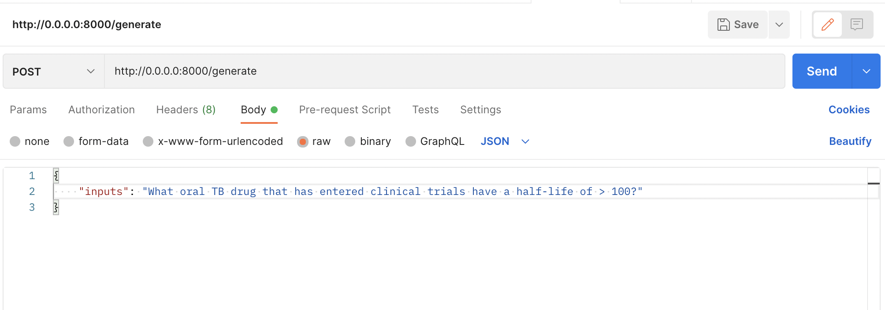

# PDF Question Answering with Large Language Models  
This repository contains notebooks and an [API](#api). The notebooks demonstrate the process of performing question answering over PDF files using two different language models: OpenAI GPT 3.5 and Llama-2. Each notebook follows a similar structure, loading PDF documents, generating embeddings using distinct embedding models, saving the embeddings in separate vector databases, and establishing a chain to answer questions based on the embeddings.  

## Notebooks
### `reacto_gpt-3.5_indexing.ipynb:`
This notebook utilizes the Base Large Language GPT 3.5 from OpenAI to perform question answering over PDF files. It follows these main steps:  
```
   1. Load PDF documents for processing.
   2. Generate embeddings using OpenIA ADA-2 embedding model.
   3. Save the embeddings in ChromaDB vector database.
   4. Implement chain to answer questions based on the embeddings.
```

### `reacto_llama-2_indexing.ipynb:` 
This notebook employs Llama-2-7B-Chat model to execute question answering over PDF files. The workflow consists of the following steps:
```
    1. Load PDF documents for processing.
    2. Generate embeddings using HuggingFace embedding model (sentence-transformers/all-MiniLM-L6-v2).
    3. Save the embeddings in FAISS vector database.
    4. Establish chain to answer questions using the embeddings.
```

## Getting Started
1. Open the specific notebook in Google collab and create a copy of the notebook.
   `reacto_gpt-3.5_indexing.ipynb`: [Open in Google Colab](https://drive.google.com/file/d/1mzTwoIsTDIyckkZqhrt1_wVD83wXIbM2/view?usp=sharing)  
   `reacto_llama-2_indexing.ipynb`: [Open in Google Colab](https://drive.google.com/file/d/1qxJPUB0da6nKar0aKnU4dLUqgT5a7sJM/view?usp=sharing)

   **Note:** for llama-2 notebook, set the google collab runtime to T4 GPU.

2. Create a folder called `"documents"` at the root directory and upload your pdf files there

3. Execute each cell in the notebook sequentially to load the PDF documents, generate embeddings, save them in the respective vector databases, and perform question answering.

<a name="api"></a>
## API
A simple FastAPI API with two endpoints: a GET endpoint that returns a "Hello, Welcome to Reacto chatbot API!" message, and a POST endpoint that takes JSON input and returns a JSON response with three fields.

### Endpoints  
GET Endpoint  
URL: /

Method: GET

Description: This endpoint returns a simple message.

Response:

```json
{
    "message": "Hello, Welcome to Reacto chatbot API!"
}
```
POST Endpoint  
URL: /generate

Method: POST

Description: This endpoint takes JSON input with a single field named `'inputs'` and returns a JSON response with three fields.

Request Body:

```json
Copy code
{
    "inputs": "What oral TB drug that has entered clinical trials have a half-life of > 100?"
}
```
Response:

```json
{
    "generated_text": "\nI'm not sure.",
    "query": "What oral TB drug that has entered clinical trials have a half-life of > 100?",
    "response_time": "2.18"
}
```
### How to Use
1. Clone the repository:

```bash
git clone https://github.com/yourusername/fastapi-api.git
cd fastapi-api
```
2. Set up a python virtual environment
```bash
python3 -m venv virtual
source virtual/bin/activate
```
3. Install the required dependencies:

```bash
pip install -r requirements.txt
```
4. Create a `'.env'` file in the root directory and add the following environment variable:
```
OPENAI_API_KEY=<your_openai_api_key>
```
5. Run the FastAPI app using uvicorn:

```bash
python start.py
```
You will get a similar screen:


### Testing the endpoints
For the POST endpoint, you can send a POST request with JSON data using a tool like curl:

```bash
curl -X POST -H "Content-Type: application/json" -d '{"inputs": "your_input_value"}' http://127.0.0.1:8000/generate
```

or using postman:


## Acknowledgments
The base language models used in this project are from the GPT-3.5 architecture developed by OpenAI and Llama-2 from Meta.  

## License
Coming soon

## Contribution
Feel free to explore, experiment, and adapt these notebooks and API for your own PDF question answering tasks.